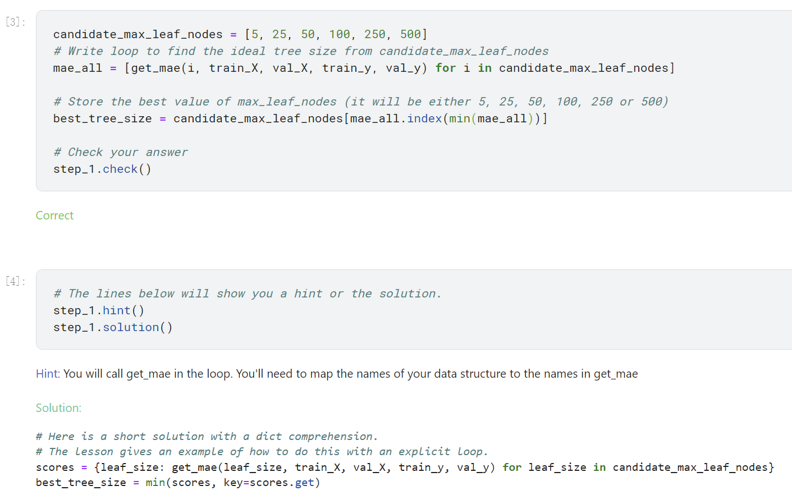
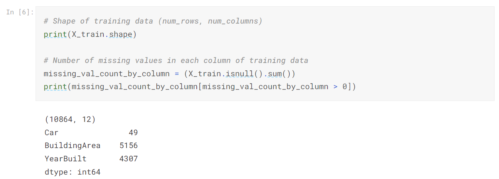
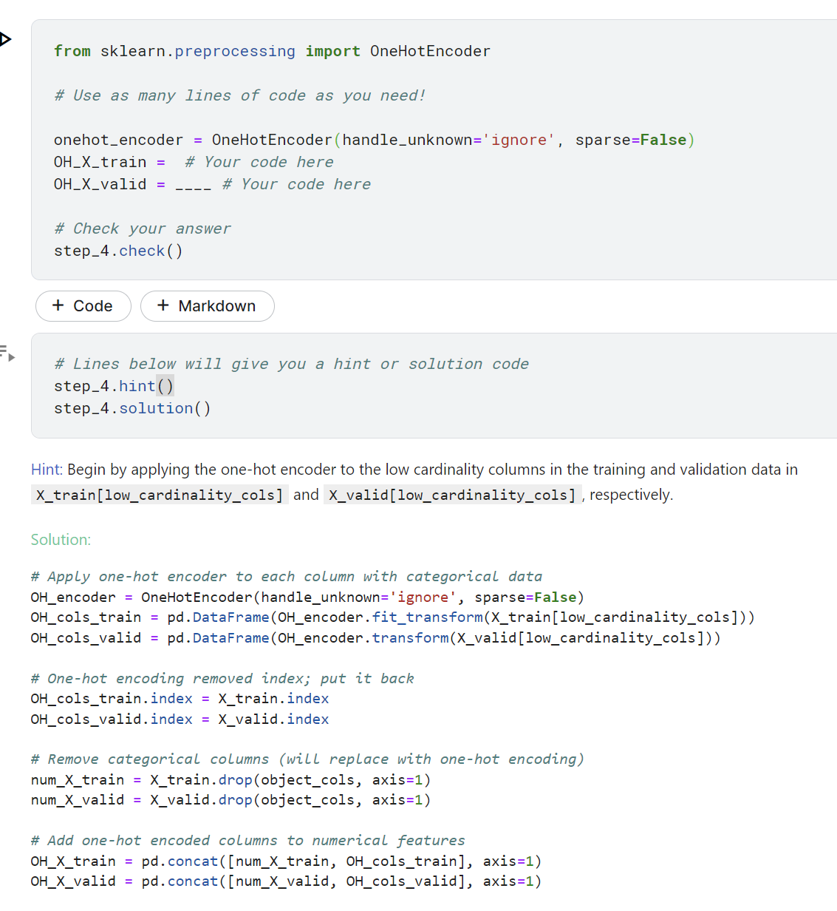
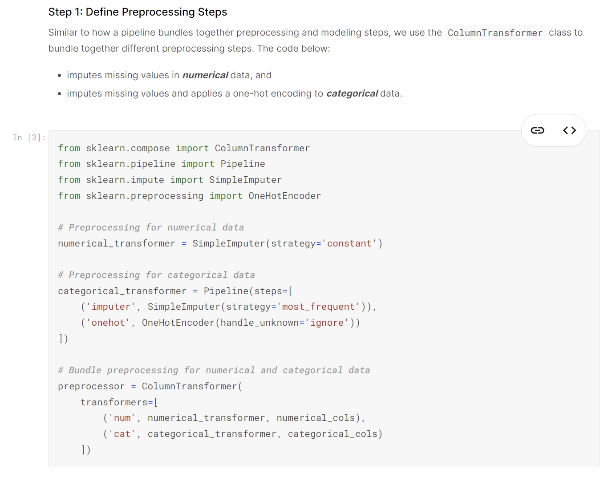

### Kaggle Course：

#### Intro to Machine Learning：

Python 特殊用法：

> ：

> The random forest uses many trees, and it makes a prediction by **averaging the predictions of each component tree. **

---

#### Intermediate Machine Learning：

##### 数据清洗：

> ![]image-20230117213328669.png)
>
> **SimpleImputer**函数，使用平均值填充缺失值；使用平均值填充后增加属性示性变量s
>
> `查看缺失值数量方法`：
>
> 

##### **One-Hot encoder**：

> 

##### ***Pipelines***：

> **Pipelines** are a simple way to keep your data preprocessing and modeling code organized. Specifically, a pipeline bundles preprocessing and modeling steps so you can use the whole bundle as if it were a single step.
>
> Many data scientists hack together models without pipelines, but pipelines have some important benefits. Those include:
>
> 1. **Cleaner Code:** Accounting for data at each step of preprocessing can get messy. With a pipeline, you won't need to manually keep track of your training and validation data at each step.
> 2. **Fewer Bugs:** There are fewer opportunities to misapply a step or forget a preprocessing step.
> 3. **Easier to Productionize:** It can be surprisingly hard to transition a model from a prototype to something deployable at scale. We won't go into the many related concerns here, but pipelines can help.
> 4. **More Options for Model Validation:** You will see an example in the next tutorial, which covers cross-validation.
>
> 

##### XGBoost:

>The most accurate modeling technique for structured data.
>
>**ensemble method**：By definition, **ensemble methods** combine the predictions of several models (e.g., several trees, in the case of random forests).
>
>==**Gradient boosting**== is a method that goes through cycles to iteratively add models into an ensemble.
>
>> Gradient Boosting 过程:
>>
>> 
>
> ==**XGBoost**== ：stands for **extreme gradient boosting**, which is an implementation of gradient boosting with several additional features focused on performance and speed. 
>
>> **parameter tuning**:
>>
>> `n_estimators` specifies how many times to go through the modeling cycle described above. 
>>
>> `early_stopping_rounds` offers a way to automatically find the ideal value for `n_estimators`. Early stopping causes the model to stop iterating when the validation score stops improving, even if we aren't at the hard stop for `n_estimators`. It's smart to set a high value for `n_estimators` and then use `early_stopping_rounds` to find the optimal time to stop iterating.
>> 
>>
>> ```python
>> my_model = XGBRegressor(n_estimators=500)
>> my_model.fit(X_train, y_train, 
>>              early_stopping_rounds=5, 
>>              eval_set=[(X_valid, y_valid)],
>>              verbose=False)
>> ```
>>
>> `n_jobs` :On larger datasets where runtime is a consideration, you can use parallelism to build your models faster. It's common to set the parameter `n_jobs` equal to the number of cores on your machine. 

##### **data leakage**:

> **Data leakage** (or **leakage**) happens when your training data contains information about the target, but similar data will not be available when the model is used for prediction. This leads to high performance on the training set (and possibly even the validation data), but the model will perform poorly in production.
>
> =There are two main types of leakage: **target leakage** and **train-test contamination.**=
>
> >  **Target leakage** occurs when your predictors include data that will not be available at the time you make predictions. It is important to think about target leakage in terms of the *timing or chronological order* that data becomes available, not merely whether a feature helps make good predictions.
> >
> > Recall that validation is meant to be a measure of how the model does on data that it hasn't considered before. You can corrupt this process in subtle ways if the validation data affects the preprocessing behavior. This is sometimes called **train-test contamination**.
